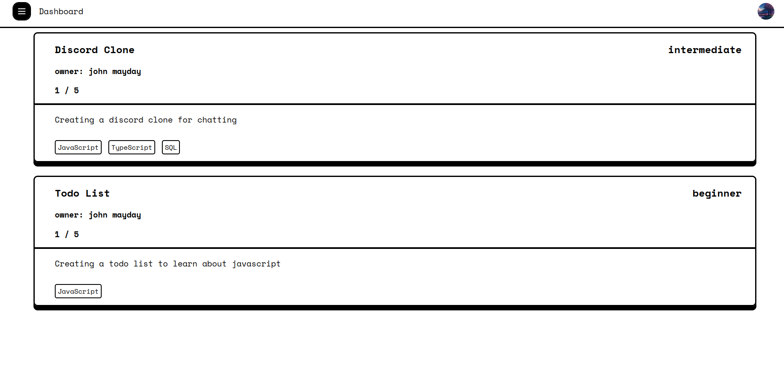

# Project Collaboration Finder

A full stack web application for finding and collaborating on projects using react and firbase

## Try it out

It's hosted on firebase! Try it out [here](https://project-collab-64e50.web.app)

## Features
- Sign in with google using firebase's authentication
- Project Recommendation based on user's level
- Create projects rooms to find other user's
- Explore and join other projects
- Realtime chatting for each project room
- Notification to accept join request
- Add or forfeit features for project
- Edit profile

## Technologies

- React with vite for frontend
- CSS for styling
- Firestore database
- Firebase hosting

## Local Installation

clone, install and run
> git clone https://github.com/Jason-35/project-collab.git
> cd project-collab
> npm install
> npm run dev

requires a .env file for firebase api key project. 